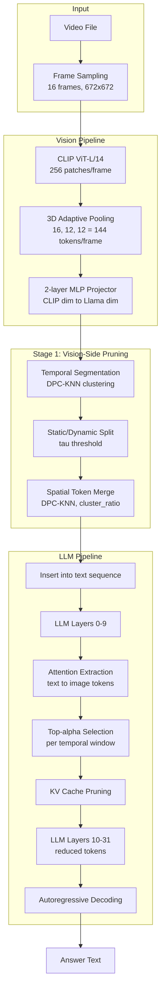

# PruneVid — Architecture, Purpose & Assessment

> **Paper**: *PruneVid: Visual Token Pruning for Efficient Video Large Language Models* (ACL 2025)
> **Authors**: Xiaohu Huang, Hao Zhou, Kai Han
> **Links**: [Webpage](https://visual-ai.github.io/prunevid/) | [Paper](https://arxiv.org/abs/2412.16117v1)

---

## 1. Project Purpose

Video Large Language Models (video LLMs) process every frame's visual tokens through every LLM layer, creating massive redundancy. For example, with 16 frames at 144 pooled tokens each, **2,304 visual tokens** pass through every decoder layer — most carrying redundant or irrelevant information.

**PruneVid** is a **training-free** visual token pruning method that reduces visual tokens to ~16-17% of the original count (~0.2x FLOPs) while **maintaining or improving accuracy** on video QA benchmarks. It operates at inference time on pretrained models with no fine-tuning required.

### Core Innovation

A two-stage pipeline that combines:
1. **Vision-side spatial-temporal merging** — reduces tokens before they enter the LLM using DPC-KNN clustering
2. **LLM-side question-aware pruning** — further prunes tokens using attention from the LLM itself, keeping only tokens relevant to the query

---

## 2. Architecture Overview

### Directory Structure

```
PruneVid/
├── models/pllava/                 # Core model implementations
│   ├── modeling_pllava.py         # Main model class + vision-side pruning
│   ├── llama.py                   # Custom LLM with VTP pruning hooks
│   ├── elastic_cache.py           # DPC-KNN clustering, VTPWindowCache
│   ├── modify_llama.py            # Alternative KV-cache strategies (experimental)
│   ├── modeling_clip.py           # Custom CLIP vision encoder
│   ├── llava_arch.py              # Multimodal projector, base classes
│   ├── configuration_pllava.py    # PllavaConfig (pruning hyperparameters)
│   ├── processing_pllava.py       # Tokenizer + image processor
│   ├── modeling_pllava_flow.py    # Optical-flow guided variant
│   ├── modeling_pllava_SF.py      # Static/flow variant
│   └── pllava_prumerge.py         # Experimental vision-side pruning prototype
│
├── tasks/
│   ├── eval/                      # Evaluation benchmarks
│   │   ├── eval_utils.py          # Conversation templates, EvalDataset
│   │   ├── model_utils.py         # load_pllava(), pllava_answer()
│   │   ├── mvbench/               # MVBench (20 subtasks)
│   │   ├── videomme/              # VideoMME
│   │   ├── egoshcema/             # EgoSchema
│   │   └── vcgbench/              # VideoChatGPT-Bench
│   └── train/                     # LoRA fine-tuning scripts
│
├── scripts/
│   ├── infer_single_video.py      # Single-video inference (baseline vs pruned)
│   └── eval.sh                    # Multi-benchmark evaluation sweep
│
├── dataset/                       # Video loading, frame indexing, datasets
├── utils/                         # Config, distributed training, logging
├── example/                       # Sample videos for testing
└── report/                        # Existing documentation
```

### Tech Stack

| Layer | Technology |
|-------|-----------|
| Language | Python 3.10 |
| Deep Learning | PyTorch 2.2.1 (CUDA 11.8/12.2) |
| LLM Framework | HuggingFace Transformers (>=4.38.0) |
| Vision Encoder | CLIP ViT-L/14 (custom `modeling_clip.py`) |
| Language Model | LLaMA (custom `llama.py` with VTP hooks) |
| Multimodal Projector | 2-layer MLP (CLIP dim → Llama dim) + 3D adaptive pooling |
| Parameter-Efficient Training | PEFT (LoRA, rank=128) |
| Distributed Training | Accelerate, DeepSpeed (ZeRO Stage 2/3), FSDP |
| Attention Optimization | Flash Attention 2, SDPA |
| Video Loading | decord (primary), pyav (fallback) |
| Experiment Tracking | Weights & Biases, TensorBoard |

### Component Diagram



---

## 3. Two-Stage Pruning Pipeline

### Stage 1: Vision-Side Spatial-Temporal Merging

**File**: `models/pllava/modeling_pllava.py` → `merge_frames_dynamic()`

```
Input: 2,304 tokens (16 frames × 144 pooled tokens)

1. Temporal Segmentation
   - Cluster frames into temporal windows using DPC-KNN
   - temporal_segment_ratio=0.25 → 4 windows of 4 frames each

2. Static vs Dynamic Separation
   - Per-patch cosine similarity across frames within each window
   - Similarity > τ (0.8) → static (consistent across frames)
   - Similarity ≤ τ → dynamic (changing across frames)

3. Spatial Token Merge (DPC-KNN)
   - Within each static/dynamic group per window:
     - Compute N×N cosine similarity matrix
     - DPC-KNN: density (ρ) × distance (δ) clustering
     - Keep cluster_ratio (0.5) of centroids
   - Output: ~500-800 merged tokens (~65-75% reduction)
```

**DPC-KNN Algorithm Detail**:
- `ρ_i` = sum of similarities to top-k neighbors (k=7)
- `δ_i` = min distance to any point with higher ρ
- Cluster centers = points with γ = ρ × δ above threshold
- Each point assigned to nearest higher-ρ neighbor

### Stage 2: LLM-Side Question-Aware Pruning

**File**: `models/pllava/llama.py` → `LlamaModelVTP` + `VTPWindowCache`

```
Input: ~500-800 merged visual tokens in text sequence

1. Forward pass through LLM layers 0..9 (normal)

2. At selected_layer (default=10):
   - Compute multi-head attention: Q_text × K_visual
   - Extract text-to-image attention scores

3. Dual-Threshold Pruning:
   - α (0.4): keep top-40% scoring visual tokens per window
   - τ (0.8): keep tokens with attention score > 0.8

4. KV Cache Pruning:
   - Remove k/v entries for pruned visual tokens
   - Update hidden states

5. Continue decoding through layers 11..31 on reduced cache
   - Output: ~200-320 tokens (~85-90% total reduction)
```

### Pruning Effect Summary

| Stage | Input Tokens | Output Tokens | Reduction |
|-------|-------------|---------------|-----------|
| Raw vision (16 frames × 144 pooled) | 2,304 | — | — |
| After Stage 1 (DPC-KNN merge) | 2,304 | ~500-800 | ~65-75% |
| After Stage 2 (text-pivot prune) | ~500-800 | ~200-320 | ~60% |
| **Total** | **2,304** | **~200-320** | **~85-90%** |

---

## 4. Key Modules

### `models/pllava/modeling_pllava.py`
- **`PllavaForConditionalGeneration`**: Main model class wrapping CLIP + Llama + projector
- **`merge_frames_dynamic()`**: Core Stage 1 logic — temporal segmentation, static/dynamic split, DPC-KNN spatial merge
- **`spatial_merge_tokens()`**: DPC-KNN clustering and centroid computation

### `models/pllava/elastic_cache.py`
- **`VTPWindowCache`**: Manages per-window clustering, static/dynamic separation, cross-window alignment
- **`FastVTSPruner`**: DPC-KNN clustering engine — cosine similarity, cluster centers, token merging
- **`ElasticCachePruner`**: Alternative elastic cache pruning strategy
- DPC-KNN core implementation

### `models/pllava/llama.py`
- **`LlamaForCausalLMVTP`**: Custom Llama with VTP hook at `selected_layer`
- **`LlamaModelVTP`**: Modified forward pass that exposes attention for pruning
- **`TextPivotMerge_LayerWise`**: Attention-based visual token pruning — extracts scores, applies thresholds, updates KV cache

### `models/pllava/modify_llama.py`
- Alternative attention variants: H2O, MixMer, PivotMerge, WeightedMerge, TextPrior
- Experimental/baseline methods for comparison

### `models/pllava/configuration_pllava.py`
- **`PllavaConfig`**: Extends HF config with pruning hyperparameters

### `tasks/eval/model_utils.py`
- **`load_pllava()`**: Model loading with pruning config propagation
- **`pllava_answer()`**: Inference pipeline

---

## 5. Configuration & Hyperparameters

| Parameter | Default | Description |
|-----------|---------|-------------|
| `alpha` | 0.4 | Fraction of visual tokens kept after LLM-side pruning |
| `tau` | 0.8 | Similarity threshold for static vs dynamic separation |
| `temporal_segment_ratio` | 0.25 | Fraction of frames used as temporal windows |
| `cluster_ratio` | 0.5 | Fraction of spatial clusters retained per group |
| `selected_layer` | 10 | LLM layer where attention-based pruning occurs |
| `pooling_shape` | (16, 12, 12) | 3D adaptive pooling: (frames, height, width) |
| `num_frames` | 16 | Number of sampled video frames |
| `lora_alpha` | 14 | LoRA scaling factor for fine-tuning |

### Benchmark Results (PLLaVA-7B)

| Method | Retained | FLOPs | MVBench | VideoMME | EgoSchema |
|--------|----------|-------|---------|----------|-----------|
| PLLaVA (baseline) | 100% | 1.00x | 46.6 | 44.4 | 47.8/42.6 |
| w/ FastV | 30% | 0.33x | 46.1 | 43.6 | 46.2/41.0 |
| w/ Prumerge | 55.7% | 0.53x | 45.6 | 43.8 | 45.2/40.4 |
| w/ Look-M | 20% | 1.00x | 46.6 | 44.3 | 47.0/42.3 |
| **w/ PruneVid** | **16.2%** | **0.23x** | **47.6** | **45.3** | **49.0/42.6** |

PruneVid achieves **better accuracy with ~5x fewer FLOPs** across all three tested video LLMs (PLLaVA, ST-LLM, LLaVA-OneVision).

---

## 6. Assessment

### Strengths

1. **Training-Free Design**: No fine-tuning required — applies directly to pretrained models. This makes it immediately usable and avoids the cost of additional training.

2. **Significant Efficiency Gains**: Reduces visual tokens to ~16% of original count with ~0.2x FLOPs while **improving** accuracy on benchmarks. This is a rare win-win.

3. **Elegant Two-Stage Architecture**: Combining spatial-temporal merging (vision-side) with question-aware pruning (LLM-side) is a well-motivated design. The stages are complementary — Stage 1 removes spatial redundancy, Stage 2 removes question-irrelevant tokens.

4. **Multi-Model Compatibility**: Demonstrated on three different video LLMs (PLLaVA, ST-LLM, LLaVA-OneVision), showing the method is not model-specific.

5. **Comprehensive Benchmarking**: Evaluated on MVBench (20 subtasks), VideoMME, EgoSchema, and VCGBench with configurable hyperparameter sweeps.

6. **Reproducibility**: Clear evaluation scripts, configuration system, and single-video inference script for quick testing.

### Weaknesses

1. **Incomplete Release**: Only PLLaVA integration is implemented. ST-LLM and LLaVA-OneVision (marked TODO in README) are not yet available, limiting immediate applicability.

2. **Bloated Dependencies**: `requirements.txt` contains 260 packages. Many are unnecessary for inference (e.g., training-specific libraries, multiple video backends). This creates installation friction and potential conflicts.

3. **Hardcoded Paths**: Scripts contain hardcoded relative paths (`DATAS/`, `MODELS/`, `test_results/`) without CLI override options. This breaks portability across different environments.

4. **Sparse Documentation**: Inline code comments are minimal. The complex DPC-KNN clustering logic and cross-window alignment in `elastic_cache.py` lack sufficient explanation for newcomers.

5. **No Unit Tests**: No test suite exists for core components (DPC-KNN clustering, static/dynamic separation, attention-based pruning). This makes refactoring risky and bug detection manual.

6. **Experimental Code Mixed with Production**: `modify_llama.py` contains 6+ alternative pruning strategies (H2O, PivotMerge, etc.) that appear unused in the main pipeline but add complexity and confusion.

7. **Marginal Accuracy Gains**: While the FLOPs reduction is impressive, the accuracy improvements are modest (<1% on most benchmarks). The method's value is primarily in efficiency, not capability.

8. **Limited CLI Abstraction**: Evaluation scripts require manual parameter configuration in shell scripts. No unified CLI interface with proper argument parsing exists.

9. **No Runtime Benchmarking**: The inference script reports wall-clock time but doesn't provide structured performance profiling (memory usage, per-layer latency, throughput metrics).

### Overall Assessment

PruneVid is a **well-researched and effective** visual token pruning method with a sound two-stage design. Its training-free nature and significant FLOPs reduction make it practically valuable for deploying video LLMs in resource-constrained environments. However, the codebase would benefit from better organization, documentation, testing, and a more streamlined dependency footprint to match the quality of the research.

---

*Document generated from codebase analysis. See `report/PRUNEVID_REPORT.md` and `report/summary.md` for additional implementation details.*
